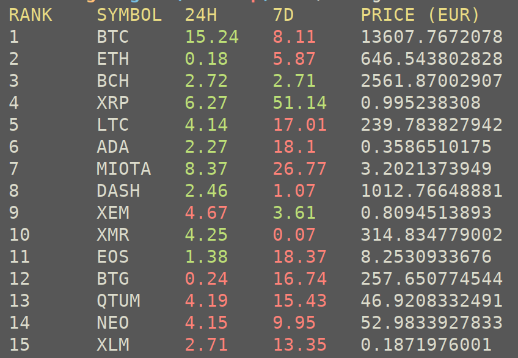

```
           _                  _
  ___ ___ (_)_ __   __ _  ___| |_
 / __/ _ \| | '_ \ / _` |/ _ \ __|
| (_| (_) | | | | | (_| |  __/ |_
 \___\___/|_|_| |_|\__, |\___|\__|
                   |___/
```

Display the values and ranking of your favorite crypto currency in your terminal.💸



## Help ##

    Optional arguments:
    -c, --convert=SYM          display value in currency
    -i, --coin id=SYM          display specific crypto
    -l, --limit=NUM            display NUM cryptos
    -s, --start=NUM            start displaying from given rank
    -?, --help                 Give this help list
        --usage                Give a short usage message
    -V, --version              Print program version

The `-c` option only supports AUD, BRL, CAD, CHF, CLP, CNY, CZK, DKK, EUR, GBP, HKD, HUF, IDR, ILS, INR, JPY, KRW, MXN, MYR, NOK, NZD, PHP, PKR, PLN, RUB, SEK, SGD, THB, TRY, TWD, ZAR.
The `-i` option should be the name of the crypto, for example `bitcoin` or `ethereum`.

## Bugs ##
Report bugs or questions to <https://github.com/Olavhaasie/coinget/issues/new>.

## Dependencies ##
+ [libcurl](https://curl.haxx.se/libcurl/)
+ [argp](https://www.gnu.org/software/libc/manual/html_node/Argp.html)
+ and of course [jsmn](https://github.com/zserge/jsmn)

The first two must be downloaded/installed. The JSON library is included as git sub module.
Also the cryptocurrency information originates from <https://coinmarketcap.com>.

The code was developed on Linux, but will also possibly work on MacOS.

## Compile ##
first clone the repository

    $ git clone --recursive https://github.com/Olavhaasie/coinget

The option `recursive` will also clone the `jsmn` dependency. Then

    $ cd coinget && make

And now you can run with

    $ ./coinget

## License ##
This software is distributed under MIT license 📝

