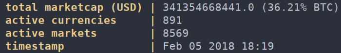

```
           _                  _
  ___ ___ (_)_ __   __ _  ___| |_
 / __/ _ \| | '_ \ / _` |/ _ \ __|
| (_| (_) | | | | | (_| |  __/ |_
 \___\___/|_|_| |_|\__, |\___|\__|
                   |___/
```

Display the values and ranking of your favorite crypto currency in your terminal.💸

[](https://github.com/Olavhaasie/coinget/blob/master/LICENSE) [](https://github.com/Olavhaasie/coinget/releases) 

[](https://github.com/Olavhaasie/coinget/star) [](https://github.com/Olavhaasie/coinget/tree/master/src)

[](https://aur.archlinux.org/packages/coinget)

## Screenshots ##




## Help ##
Coinget has 3 available commands:

| Command   | Description                           |
| --------- | ------------------------------------- |
| list      | list ranking and values of cryptos    |
| stats     | list global crypto market information |
| portfolio | list your own investments and profits |

    Program options:
    -c, --convert=SYM          display value in currency
    -i, --coin-id=SYM          display specific crypto
    -l, --limit=NUM            display NUM cryptos
    -n, --no-color             disable color output
    -p, --portfolio=file       use portfolio file
    -s, --start=NUM            start displaying from given rank

    Informational options:
    -?, --help                 Give this help list
        --usage                Give a short usage message
    -V, --version              Print program version

The `-c` option only supports AUD, BRL, CAD, CHF, CLP, CNY, CZK, DKK, EUR, GBP, HKD, HUF, IDR, ILS, INR, JPY, KRW, MXN, MYR, NOK, NZD, PHP, PKR, PLN, RUB, SEK, SGD, THB, TRY, TWD, USD, ZAR.
The `-i` option should be the name of the crypto, for example `bitcoin` or `ethereum`.

### Portfolio ###
Coinget automatically looks for a `.coins` file in your home directory if no file was given using the `portfolio` subcommand.
If the file does not exist, it must be specified after the `portfolio` command or using the `-p` option.

The first line of this file must contain a currency (same as for `-c` option).
The next lines must be space separated values containing the crypto id, the amount of coins and the investment in the given currency.
So for example:

    EUR
    bitcoin 1.0001 100
    ripple 20.2 20
    litecoin 20 20
    garlicoin 0.1 0.01

### Examples ###

| Command                       | Description                                             |
| ----------------------------- | ------------------------------------------------------- |
| `coinget list -l 100 -c EUR`  | list top 100 coins with prices in euros                 |
| `coinget list -l 0`           | list all coins on the market in USD                     |
| `coinget list -s 1000 -l 10`  | list 10 coins with rank lower than 1000                 |
| `coinget list bitcoin ripple` | list values of bitcoin and ripple                       |
| `coinget stats -c AUD`        | list global market stats converted to AUD               |
| `coinget portfolio coins`     | list your own investments and profits from file _coins_ |

## Bugs ##
Report bugs or questions to <https://github.com/Olavhaasie/coinget/issues/new>.

## Dependencies ##
+ [libcurl](https://curl.haxx.se/libcurl/)
+ [argp](https://www.gnu.org/software/libc/manual/html_node/Argp.html)
+ and of course [jsmn](https://github.com/zserge/jsmn)

The first two must be downloaded/installed. The JSON library is included as git sub module.
Also the cryptocurrency information originates from <https://coinmarketcap.com>.

The code was developed on Linux, but also works on macOS.

## Install ##

### Manual ###
First clone the repository

    $ git clone --recursive https://github.com/Olavhaasie/coinget

The option `recursive` will also clone the `jsmn` dependency. Then

    $ cd coinget
    $ cmake -S . -B build
    $ make -C build

The `coinget` executable will be generated inside the `build/` directory and
can be run with

    $ ./build/coinget

`coinget` can also be installed with `cmake`:

    $ cmake --install build

And now you can run with

    $ coinget

### macOS (Homebrew) ###
Homebrew users on macOS can simply tap the [repository](https://github.com/martijncomans/homebrew-coinget) made by Martijn Comans:

    $ brew tap martijncomans/homebrew-coinget
    $ brew install coinget

### Arch Linux (AUR) ###
You can download the package from <https://aur.archlinux.org/packages/coinget>.

## License ##
This software is distributed under MIT license 📝

