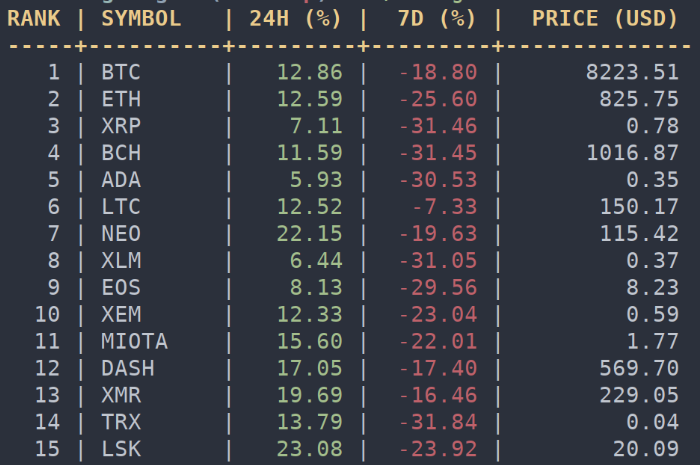

```
           _                  _
  ___ ___ (_)_ __   __ _  ___| |_
 / __/ _ \| | '_ \ / _` |/ _ \ __|
| (_| (_) | | | | | (_| |  __/ |_
 \___\___/|_|_| |_|\__, |\___|\__|
                   |___/
```

Display the values and ranking of your favorite crypto currency in your terminal.💸



## Help ##
    Program options:
    -c, --convert=SYM          display value in currency
    -i, --coin-id=SYM          display specific crypto
    -l, --limit=NUM            display NUM cryptos
    -n, --no-color             disable color output
    -s, --start=NUM            start displaying from given rank

    Informational options:
    -?, --help                 Give this help list
    --usage                Give a short usage message
    -V, --version              Print program version

The `-c` option only supports AUD, BRL, CAD, CHF, CLP, CNY, CZK, DKK, EUR, GBP, HKD, HUF, IDR, ILS, INR, JPY, KRW, MXN, MYR, NOK, NZD, PHP, PKR, PLN, RUB, SEK, SGD, THB, TRY, TWD, ZAR.
The `-i` option should be the name of the crypto, for example `bitcoin` or `ethereum` and can be used multiple times like:

    $ coinget -i bitcoin -i ethereum

or

    $ coinget bitcoin ethereum ripple


## Bugs ##
Report bugs or questions to <https://github.com/Olavhaasie/coinget/issues/new>.

## Dependencies ##
+ [libcurl](https://curl.haxx.se/libcurl/)
+ [argp](https://www.gnu.org/software/libc/manual/html_node/Argp.html)
+ and of course [jsmn](https://github.com/zserge/jsmn)

The first two must be downloaded/installed. The JSON library is included as git sub module.
Also the cryptocurrency information originates from <https://coinmarketcap.com>.

The code was developed on Linux, but also works on macOS.

## Install ##
First clone the repository

    $ git clone --recursive https://github.com/Olavhaasie/coinget

The option `recursive` will also clone the `jsmn` dependency. Then

    $ cd coinget
    $ make
    $ sudo make install

And now you can run with

    $ coinget

If you want to remove the program you can do

    $ sudo make uninstall

### macOS (Homebrew) ###
Homebrew users on macOS can simply tap the [repository](https://github.com/martijncomans/homebrew-coinget) made by Martijn Comans:

    $ brew tap martijncomans/homebrew-coinget
    $ brew install coinget

## License ##
This software is distributed under MIT license 📝

